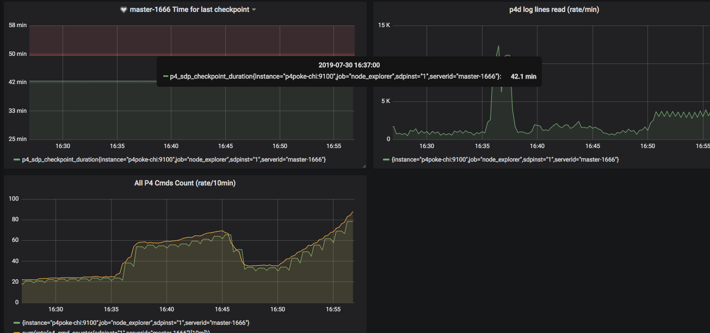
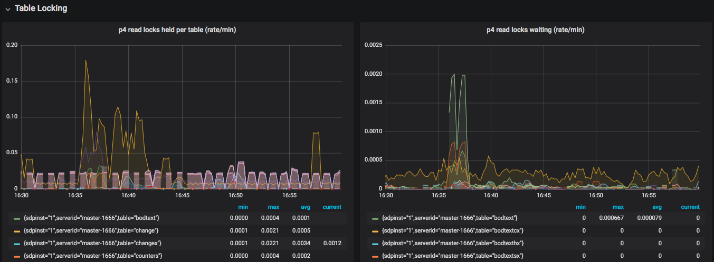

# p4prometheus

Utility which integrates Perforce (Helix Core) with Prometheus. If performs real-time analysis of p4d log files feeding to a dashboard and for system alerting.

It continuously parses p4d log files and write a summary to 
a specified Prometheus compatible metrics file which can be handled via the `node_exporter`
textfile collector module.

Uses [go-libp4dlog](https://github.com/rcowham/go-libp4dlog) for actual log file parsing.

## Overview

This is part of a solution consisting of the following components:

* Prometheus - time series metrics management system: https://prometheus.io/
* Grafana - The leading open source software for time series analytics - https://grafana.com/
* node_exporter - Prometheus collector for basic Linux metrics - https://github.com/prometheus/node_exporter

Two custom components:

* p4prometheus - This component.
* monitor_metrics.sh - [SDP](https://swarm.workshop.perforce.com/projects/perforce-software-sdp) compatible bash script to generate simple supplementary metrics - [monitor_metrics.sh](https://swarm.workshop.perforce.com/files/guest/perforce_software/sdp/dev/Server/Unix/p4/common/site/bin/monitor_metrics.sh)

Check out the  - the custom components are "Prometheus targets".

# Grafana Dashboards

When installed and setup, you can get dashboards such as the following to appear.

Commands Summary:



Rates for command durations and count:


Active commands (monitor):


Replication status:


Read/write locks held/waiting status:



Dashboard alerts can be defined, as well as alert rules which are actioned by [alertmanager](https://prometheus.io/docs/alerting/alertmanager/)

# Detailed Installation

You need to install Prometheus and Grafana using standard methods. This is typically done on a seperate VM/machine to the Perforce server itself (for security and HA reasons).

For example:

* https://www.howtoforge.com/tutorial/how-to-install-grafana-on-linux-servers/
* https://www.howtoforge.com/tutorial/how-to-install-prometheus-and-node-exporter-on-centos-7/

## Install node_exporter

Use above instructions, or these. This must be done on the Perforce (Helix Core) server machine (ditto for any other servers such as replicas which are being monitored).

Run the following as root:

    sudo useradd --no-create-home --shell /bin/false node_exporter

    export PVER="0.18.0"
    wget https://github.com/prometheus/node_exporter/releases/download/v$PVER/node_exporter-$PVER.linux-amd64.tar.gz

    tar xvf node_exporter-$PVER.linux-amd64.tar.gz 
    
    mv node_exporter-$PVER.linux-amd64/node_exporter /usr/local/bin/

Create a metrics directory, give ownership to account writing metrics, and make sure it has global read access (so `node_exporter` account can read entries)

    mkdir /hxlogs/metrics

    chown perforce:perforce /hxlogs/metrics
    
    ls -al /hxlogs/metrics

Ensure the above has global read access (perforce user will write files, node_exporter will read them).

Create service file:

```ini
cat << EOF > /etc/systemd/system/node_exporter.service
[Unit]
Description=Node Exporter
Wants=network-online.target
After=network-online.target

[Service]
User=node_exporter
Group=node_exporter
Type=simple
ExecStart=/usr/local/bin/node_exporter --collector.textfile.directory=/hxlogs/metrics

[Install]
WantedBy=multi-user.target
EOF
```

Start and enable service:

    sudo systemctl daemon-reload
    sudo systemctl start node_exporter
    sudo systemctl status node_exporter
    sudo systemctl enable node_exporter

Check logs for service in case of errors:

    journalctl -u node_exporter --no-pager | tail

Check that metrics are being exposed:

    curl http://localhost:9100/metrics | less

## Install p4prometheus - details

This must be done on the Perforce (Helix Core) server machine (and any replica machines).

This assumes SDP structure is in use on the server, and thus that user `perforce` exists.

Get latest release download link: https://github.com/rcowham/p4prometheus/releases

Run the following as `root` (using link copied from above page):

    wget https://github.com/rcowham/p4prometheus/files/3446515/p4prometheus.linux-amd64.gz

    gunzip p4prometheus.linux-amd64.gz
    
    chmod +x p4prometheus.linux-amd64

    mv p4prometheus.linux-amd64 /usr/local/bin/p4prometheus

As user `perforce`:

```bash
cat << EOF > /p4/common/config/p4prometheus.yaml
# SDP instance - typically integer, but can be
# See: https://swarm.workshop.perforce.com/projects/perforce-software-sdp for more
sdp_instance:   1
# Path to p4d server log
log_path:       /p4/1/logs/log
# Name of output file to write for processing by node_exporter
metrics_output: /hxlogs/metrics/p4_cmds.prom
# Optional - serverid for metrics - typically read from /p4/<sdp_instance>/root/server.id
server_id:      
EOF
```

As user `root`:

Create service file:

```ini
cat << EOF > /etc/systemd/system/p4prometheus.service
[Unit]
Description=P4prometheus
Wants=network-online.target
After=network-online.target

[Service]
User=perforce
Group=perforce
Type=simple
ExecStart=/usr/local/bin/p4prometheus --config=/p4/common/config/p4prometheus.yaml

[Install]
WantedBy=multi-user.target
EOF
```

Start and enable service:

    sudo systemctl daemon-reload
    sudo systemctl start p4prometheus
    sudo systemctl status p4prometheus
    sudo systemctl enable p4prometheus

Check logs for service in case of errors:

    journalctl -u p4prometheus --no-pager | tail

Check that metrics are being written:

    cat /hxlogs/metrics/p4_cmds.prom

# Alerting

Done via alertmanager

Setup is very similar to the above.

Sample `/etc/systemd/system/alertmanager.service`:

```ini
[Unit]
Description=Alertmanager
Wants=network-online.target
After=network-online.target

[Service]
User=alertmanager
Group=alertmanager
Type=simple
ExecStart=/usr/local/bin/alertmanager --config.file=/etc/alertmanager/alertmanager.yml --storage.path=/var/lib/alertmanager --log.level=debug

[Install]
WantedBy=multi-user.target
```

* create alertmanager user
* create /etc/alertmanager directory


## Prometheus config

```yaml
global:
  scrape_interval:     15s # Set the scrape interval to every 15 seconds. Default is every 1 minute.
  evaluation_interval: 15s # Evaluate rules every 15 seconds. The default is every 1 minute.
  # scrape_timeout is set to the global default (10s).

# Alertmanager configuration
alerting:
  alertmanagers:
  - static_configs:
    - targets:
        - localhost:9093

# Load rules once and periodically evaluate them according to the global 'evaluation_interval'.
rule_files:
  - "perforce_rules.yml"

# A scrape configuration containing exactly one endpoint to scrape:
# Here it's Prometheus itself.
scrape_configs:
  - job_name: 'prometheus'
    static_configs:
    - targets: ['localhost:9090']

  - job_name: 'node_exporter'
    static_configs:
    - targets: ['p4hms:9100', 'p4main:9100', 'p4_ha:9100']

```

## Alerting rules

This is an example, assuming simple email and local postfix or equivalent setup.

```yaml
groups:
- name: alert.rules
  rules:
  - alert: NoLogs
    expr: 100 > rate(p4_prom_log_lines_read{sdpinst="1",serverid="master"}[1m])
    for: 1m
    labels:
      severity: "critical"
    annotations:
      summary: "Endpoint {{ $labels.instance }} too few log lines"
      description: "{{ $labels.instance }} of job {{ $labels.job }} has been below target for more than 1 minutes."
  - alert: Replication Slow HA
    expr: p4_replica_curr_pos{instance="p4master:9100",job="node_exporter",sdpinst="1",servername="master"} - ignoring(serverid,servername) p4_replica_curr_pos{instance="p4master:9100",job="node_exporter",sdpinst="1",servername="p4d_ha_bos"} > 5e+7
    for: 10m
    labels:
      severity: "warning"
    annotations:
      summary: "Endpoint {{ $labels.instance }} replication warning"
      description: "{{ $labels.instance }} of job {{ $labels.job }} has been above target for more than 1 minutes."
  - alert: Replication Slow London
    expr: p4_replica_curr_pos{instance="p4master:9100",job="node_exporter",sdpinst="1",servername="master"} - ignoring(serverid,servername) p4_replica_curr_pos{instance="p4master:9100",job="node_exporter",sdpinst="1",servername="p4d_fr_lon"} > 5e+7
    for: 10m
    labels:
      severity: "warning"
    annotations:
      summary: "Endpoint {{ $labels.instance }} replication warning"
      description: "{{ $labels.instance }} of job {{ $labels.job }} has been above target for more than 1 minutes."
  - alert: Checkpoint slow
    expr: p4_sdp_checkpoint_duration{sdpinst="1",serverid="master"} > 50 * 60
    for: 5m
    labels:
      severity: "warning"
    annotations:
      summary: "Endpoint {{ $labels.instance }} checkpoint job duration longer than expected"
      description: "{{ $labels.instance }} of job {{ $labels.job }} has been above target for more than 1 minutes."
  - alert: Checkpoint not taken 
    expr: time() - p4_sdp_checkpoint_log_time{sdpinst="1",serverid="master"} > 25 * 60 * 60
    for: 5m
    labels:
      severity: "warning"
    annotations:
      summary: "Endpoint {{ $labels.instance }} checkpoint not taken in 25 hours warning"
      description: "{{ $labels.instance }} of job {{ $labels.job }} has been above target for more than 1 minutes."
  - alert: P4D service not running
    expr: node_systemd_unit_state{state="active",name="p4d_1.service"} != 1
    for: 5m
    labels:
      severity: "warning"
    annotations:
      summary: "Endpoint {{ $labels.instance }} p4d service not running"
      description: "{{ $labels.instance }} of job {{ $labels.job }} has been down for 5 minutes."
  - alert: DiskspaceLow
    expr: node_filesystem_free_bytes{mountpoint=~"/hx.*"} / node_filesystem_size_bytes{mountpoint=~"/hx.*"} * 100 < 10
    for: 5m
    labels:
      severity: "warning"
    annotations:
      summary: "Endpoint {{ $labels.instance }} disk space below 10%"
      description: "{{ $labels.instance }} of job {{ $labels.job }} has been below limit for 5 minutes."
```

## Alertmanager config

This is an example, assuming simple email and local postfix or equivalent setup - `/etc/alertmanager/alertmanager.yml`

```yaml
global:
  smtp_from: alertmanager@perforce.com
  smtp_smarthost: localhost:25
  smtp_require_tls: false
  # Hello is the local machine name
  smtp_hello: p4hms

route:
  group_by: ['alertname']
  group_wait: 30s
  group_interval: 5m
  repeat_interval: 60m
  receiver: mail

receivers:
- name: mail
  email_configs:
  - to: p4-group@perforce.com
```
